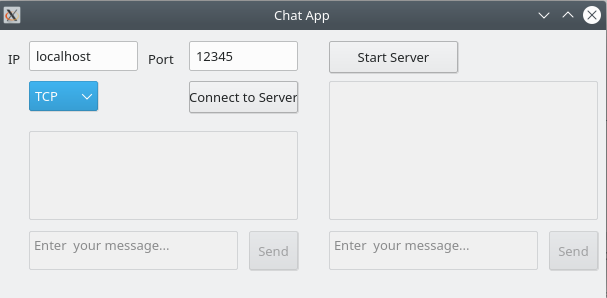
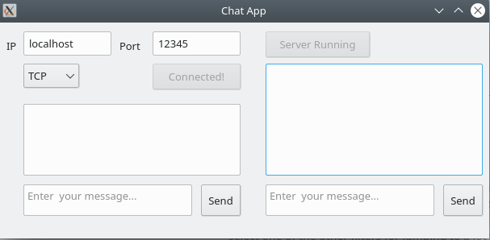
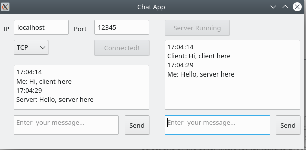

# Chat-Application
This is a simple chat application based on Qt5 frameworks.
It uses TCP protocol. 
User can provide in IP and Port number at which the connection should be started.

Steps:
1. Click on "Start Server"
2. When the button showns "Server running", then click on "Connect to server"
3. After the client is connected, a message box confirms  the connection to the remote server
4. Start sending messages from both the sides

